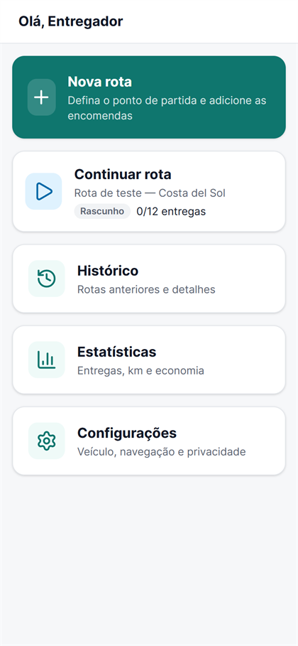
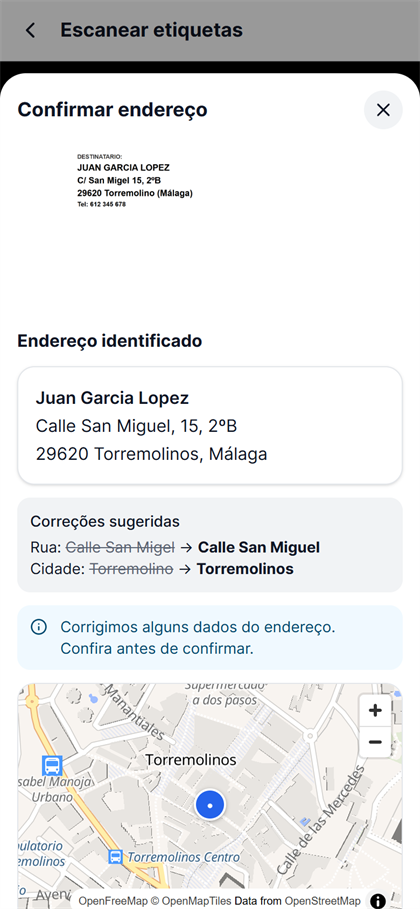
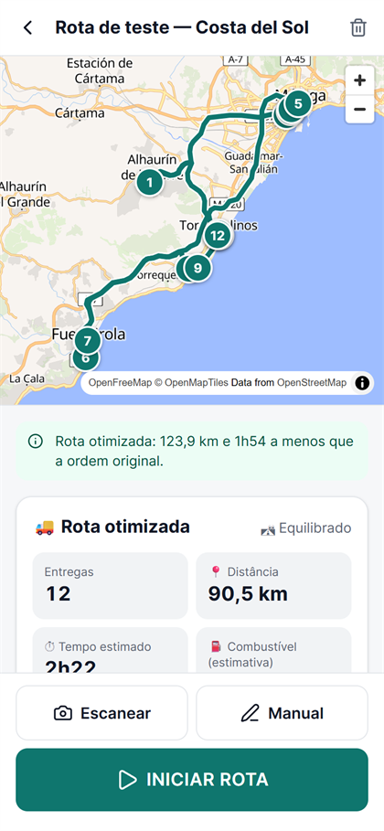
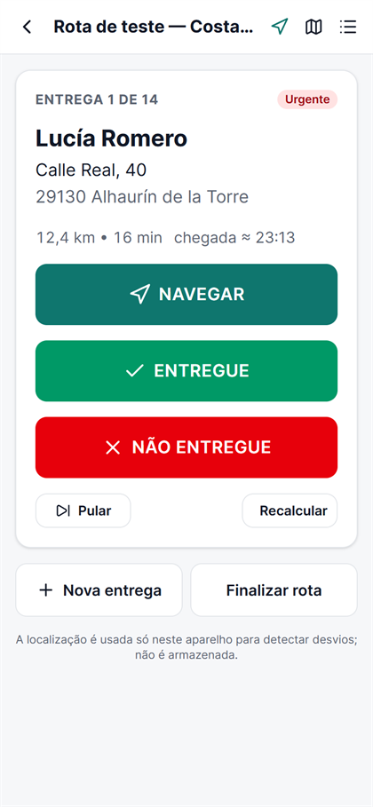
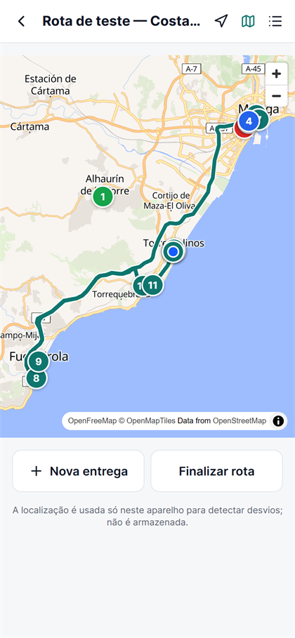
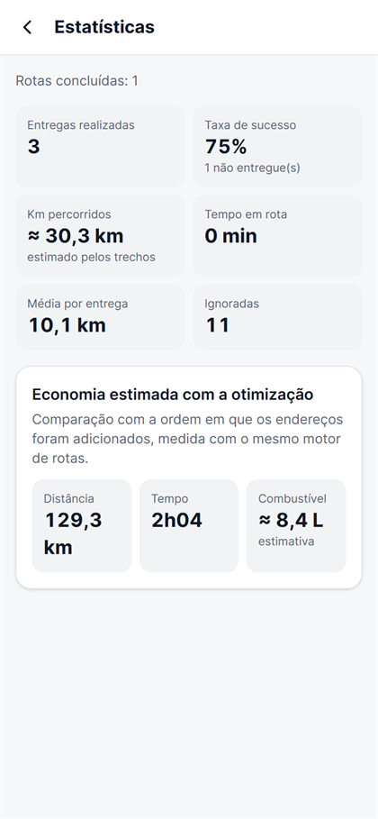
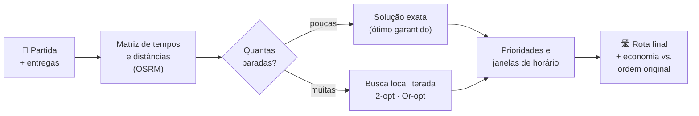
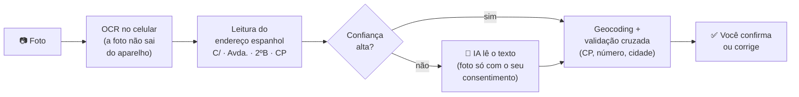
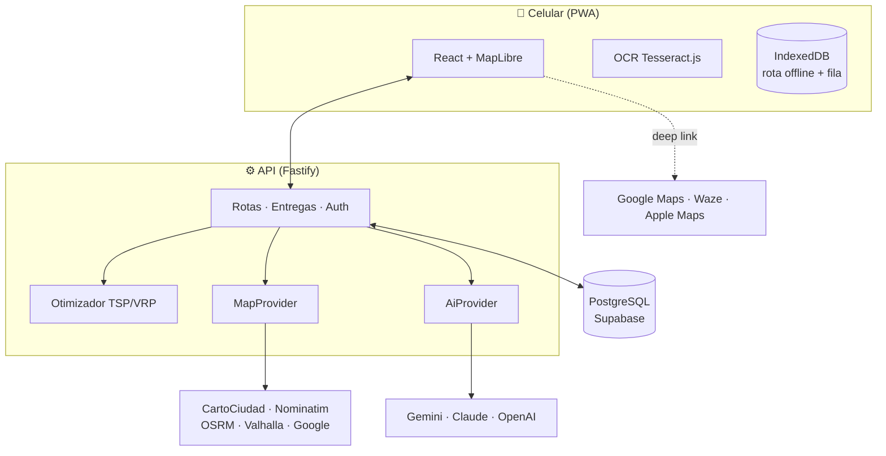

<div align="center">


# Derepart

**Fotografe as etiquetas. Calcule a melhor rota. Entregue mais rápido.**

PWA para entregadores que lê os endereços das encomendas, organiza as paradas na melhor
ordem possível e manda cada destino para o Google Maps, o Waze ou o Apple Maps.


[Funcionalidades](#-funcionalidades) ·
[Começando](#-começando) ·
[Configuração](#-configuração) ·
[Como a rota é calculada](#-como-a-rota-é-calculada) ·
[Arquitetura](#-arquitetura) ·
[Privacidade](#-privacidade-e-segurança)

</div>

<br />

<table>
  <tr>
    <td align="center"><br /><sub><b>Início</b></sub></td>
    <td align="center"><br /><sub><b>Etiqueta lida e corrigida</b></sub></td>
    <td align="center"><br /><sub><b>Rota otimizada</b></sub></td>
  </tr>
  <tr>
    <td align="center"><br /><sub><b>Modo entrega</b></sub></td>
    <td align="center"><br /><sub><b>Mapa da rota</b></sub></td>
    <td align="center"><br /><sub><b>Estatísticas</b></sub></td>
  </tr>
</table>

<sub>Capturas reais do teste automatizado ponta a ponta. Os endereços são ruas públicas da Costa del Sol; os destinatários são fictícios.</sub>

---

## ✨ Funcionalidades

| | |
|---|---|
| 📷 **Escaneie etiquetas em sequência** | A câmera fica aberta: fotografe dezenas de pacotes seguidos. A leitura (OCR) acontece **no próprio celular**. |
| 🧠 **Endereços corrigidos, nunca aceitos às cegas** | `C/ San Migel 15, Torremolino` vira `Calle San Miguel, 15, Torremolinos`. Você vê o que foi corrigido e o ponto no mapa antes de confirmar. |
| 🛣️ **A melhor ordem de verdade** | Ordem ótima garantida para poucas paradas e heurísticas avançadas para muitas, considerando prioridades e janelas de horário. |
| ⚡⛽🛣️ **Três perfis de rota** | *Mais rápido*, *Mais econômico* ou *Equilibrado*, que evita rotas complicadas que economizam só um ou dois minutos. |
| 📊 **Economia mensurável** | Compara com a ordem original: km, tempo e combustível economizados (sempre como estimativa, com "≈"). |
| 🧭 **Navegação com o app que você já usa** | Um toque abre o destino no Google Maps, no Waze ou no Apple Maps. |
| ➕ **Mudanças no meio do caminho** | Chegaram mais pacotes? Adicione-os e recalcule **só o restante**, a partir da sua posição. |
| 📴 **Funciona sem internet** | A rota fica salva no aparelho. Entregas marcadas offline são sincronizadas quando a conexão volta. |
| 📍 **Detecção de desvio** | Avisa quando você sai da rota planejada e oferece recalcular. |
| 🗂️ **Histórico e estatísticas** | Entregas realizadas, taxa de sucesso, km por entrega e economia acumulada. |

## 🚀 Começando

> **Requisitos:** Node.js 22 ou superior. Não precisa de Docker nem de banco instalado.

```bash
npm install
cp apps/api/.env.example apps/api/.env
npm run seed        # cria uma conta demo com uma rota de teste (com a API parada)
npm run dev         # API em :8787 + app em :5173
```

Abra **http://localhost:5173** e entre com:

```
demo@derepart.local
demo12345
```

A rota *"Rota de teste — Costa del Sol"* já tem 12 endereços reais, prontos para calcular.

> [!NOTE]
> Esse é o modo sem Supabase, com login próprio da API. Com o [Supabase configurado](#-supabase-banco-e-login),
> você entra com a sua conta do Supabase Auth, e `npm run seed -- seu@email.com` adiciona a rota de teste a ela.

> [!TIP]
> **Para testar no celular:** câmera e GPS só funcionam em **HTTPS**. Publique em um domínio com
> HTTPS ou use um túnel (`cloudflared tunnel --url http://localhost:5173`). Depois, no navegador do
> celular, toque em **"Adicionar à tela inicial"** para instalar o app.

<details>
<summary><b>📜 Todos os comandos</b></summary>

| Comando | O que faz |
|---|---|
| `npm run dev` | API (com recarga automática) e app juntos |
| `npm test` | Testes do solver, do parser, da API completa e do modo offline |
| `npm run typecheck` | Checagem de tipos em todos os pacotes |
| `npm run seed` | Login local: recria a conta demo e a rota de teste |
| `npm run seed -- seu@email.com` | Supabase Auth: adiciona a rota de teste à sua conta |
| `npm run db:migrate --workspace @derepart/api` | Aplica as migrações e mostra as tabelas e o status do RLS |
| `npm run check:providers --workspace @derepart/api` | Testa ao vivo endereços, matriz e otimização com os provedores configurados |
| `npm run e2e` | Teste ponta a ponta da interface num navegador real (Edge ou Chrome), com o login local e a conta demo |
| `npm run build` · `npm start` | Build de produção; a API pode servir o app (`SERVE_WEB_DIST=../web/dist`) |

</details>

## 🔑 Configuração

O app **funciona sem nenhuma chave de API**: endereços pelo CartoCiudad (oficial da Espanha), rotas
pelo OSRM e mapas pelo OpenFreeMap. As chaves apenas ativam recursos extras.

> [!IMPORTANT]
> Chaves secretas ficam **somente** em `apps/api/.env`, no servidor. O app no navegador
> (`apps/web/.env`) só recebe valores públicos, como a publishable key do Supabase.

| Variável | Para quê | Onde conseguir |
|---|---|---|
| `DATA_ENCRYPTION_KEY` | Criptografa nome, telefone e observações dos clientes. **Obrigatória** em produção e com banco remoto | Gere com o comando abaixo |
| `DATABASE_URL` | Postgres (vazio = banco local embutido) | [Supabase](#-supabase-banco-e-login), Neon ou qualquer Postgres |
| `SUPABASE_URL` + `VITE_SUPABASE_*` | Login pelo Supabase Auth (vazio = login próprio da API) | [Supabase](#-supabase-banco-e-login) → Project Settings → API Keys |
| `AI_PROVIDER` + chave | IA para etiquetas difíceis: `gemini`, `anthropic` ou `openai` | [Google AI Studio](https://aistudio.google.com/apikey) · [Claude Console](https://platform.claude.com) · [OpenAI](https://platform.openai.com/api-keys) |
| `MAP_PROVIDER` | Motor de rotas: `osrm`, `valhalla` ou `google` | OSRM e Valhalla não precisam de chave |
| `GOOGLE_MAPS_API_KEY` | Trânsito em tempo real (opcional, pago) | [Google Cloud Console](https://console.cloud.google.com): ative Geocoding API e Routes API |

```bash
# gerar a DATA_ENCRYPTION_KEY (guarde uma cópia em lugar seguro)
node -e "console.log(require('crypto').randomBytes(32).toString('base64'))"
```

### 🟢 Supabase (banco e login)

**Banco**

1. No painel do projeto, clique em **Connect** e copie a string do **Session pooler** (porta `5432`).
2. Cole em `DATABASE_URL` (`apps/api/.env`), trocando `[YOUR-PASSWORD]` pela senha, sem os colchetes.
   Se a senha tiver `@`, `:`, `/`, `#` ou `?`, codifique esses caracteres (ex.: `@` → `%40`).
3. Defina `DATA_ENCRYPTION_KEY`.
4. Inicie a API: as migrações de [`apps/api/drizzle/`](apps/api/drizzle/) são aplicadas sozinhas.

**Login (Supabase Auth)**

1. Em `apps/api/.env`: `SUPABASE_URL=https://<projeto>.supabase.co`.
2. Em `apps/web/.env`: `VITE_SUPABASE_URL` (a mesma URL) e `VITE_SUPABASE_PUBLISHABLE_KEY`.
3. No painel, em **Authentication → URL Configuration**, coloque em *Site URL* o endereço do app e
   adicione-o em *Redirect URLs* (ex.: `http://localhost:5173/**` e o seu domínio). É para onde
   apontam os links de confirmação de e-mail e de "Esqueci minha senha".

Contas, senhas, confirmação de e-mail e recuperação de senha ficam no Supabase. A API valida os
tokens com as **chaves públicas** do projeto, sem nenhum segredo. No primeiro acesso, ela cria o
perfil do usuário com o mesmo ID do Supabase Auth. Excluir a conta no app apaga também o usuário no Supabase.

> [!WARNING]
> **Não rode os arquivos `.sql` à mão** no SQL Editor: a API registra o que já aplicou e tentaria criar tudo de novo.
> Use também o **Session pooler**: a conexão direta (`db.<projeto>.supabase.co`) só funciona em IPv6.

Todas as tabelas do app têm **RLS ativo**, então a API REST automática do Supabase não expõe nenhum
dado, nem para quem tiver a publishable key.

## 🧭 Como a rota é calculada



| Perfil | Prioriza | Ideal para |
|---|---|---|
| ⚡ **Mais rápido** | Tempo total | Dias cheios, horário apertado |
| ⛽ **Mais econômico** | Menos km e menos combustível | Rotas longas, economizar custo |
| 🛣️ **Equilibrado** | Tempo, distância **e** simplicidade | O dia a dia. Entre rotas quase iguais, escolhe a com menos manobras |

<details>
<summary><b>🔬 Detalhes do algoritmo</b></summary>

<br />

| Situação | Método |
|---|---|
| Até 13 paradas, sem restrições | **Held–Karp** (programação dinâmica): ordem ótima garantida |
| Até 9 paradas, com prioridades ou janelas | **Branch and bound**: ordem ótima garantida |
| Rotas maiores | Construção multi-start + **2-opt**, **Or-opt** e **Iterated Local Search**, com limite de tempo (~1,5 s) |

- Funciona com matrizes **assimétricas** (ida ≠ volta, por causa de mão única).
- Entregas **urgentes** puxam a parada para o início; **janelas de horário** penalizam atrasos.
- A economia exibida compara a ordem otimizada com a ordem de inserção, **medidas com o mesmo motor de rotas**.
- O sistema não "sabe" quais ruas você conhece. A simplicidade é medida por critérios objetivos: número de manobras e de trocas de via.

A análise completa, incluindo a comparação **Google Maps × OpenStreetMap** para a Espanha, com
custos, limites e qualidade, está em [**docs/ARQUITETURA.md**](docs/ARQUITETURA.md).

</details>

## 📷 Da foto ao endereço confirmado



## 🧱 Arquitetura



Os provedores de mapas e de IA são **trocáveis pelo `.env`**, sem mexer no código. O modelo de dados
(organizações → motoristas → veículos → rotas → entregas) já está pronto para virar um SaaS com
vários entregadores.

<details>
<summary><b>📁 Estrutura do projeto</b></summary>

```
derepart/
├── apps/
│   ├── api/                  Fastify + TypeScript
│   │   ├── drizzle/          migrações SQL (aplicadas automaticamente)
│   │   └── src/
│   │       ├── optimization/ solver: Held–Karp, branch & bound, ILS + 2-opt/Or-opt
│   │       ├── providers/    maps (CartoCiudad, Nominatim, OSRM, Valhalla, Google) · ai (Gemini, Claude, OpenAI)
│   │       ├── modules/      rotas, entregas, reconhecimento de etiquetas, estatísticas
│   │       └── auth/ db/ services/
│   └── web/                  React 19 + Vite + Tailwind (PWA)
│       └── src/
│           ├── pages/        Nova rota, Rota, Escanear, Modo entrega, Histórico, Estatísticas, Configurações
│           ├── components/   mapa (MapLibre), editor e confirmação de endereço
│           └── lib/          API, offline (IndexedDB), OCR, GPS e navegação
├── packages/shared/          tipos, validação (Zod), mensagens de erro, utilitários geográficos
└── docs/                     arquitetura e capturas de tela
```

</details>

## 🔒 Privacidade e segurança

- 🔐 **Dados pessoais criptografados** (AES-256-GCM): nome, telefone, complemento e observações.
- 🗑️ **Retenção configurável:** após *N* dias, os dados pessoais das rotas concluídas são apagados; ficam só os totais.
- 🙅 **Exclusão a qualquer momento:** apagar uma rota, todo o histórico ou a conta inteira.
- 📍 **Localização não é armazenada:** o GPS é usado só no aparelho; o servidor recebe a posição apenas quando você pede para recalcular.
- 🖼️ **Fotos nunca são guardadas**, e só vão para a IA com o seu consentimento explícito.
- 🛡️ Login pelo **Supabase Auth**, com tokens verificados pelas chaves públicas do projeto. Sem Supabase, o login próprio usa *scrypt*, cookie `httpOnly` e proteção CSRF. Em ambos os modos: validação de todas as entradas, *rate limiting* e RLS no Supabase.

## 🧪 Qualidade

| O que é testado | Como |
|---|---|
| **Otimizador** | Comparado com força bruta (ótimo exato) em cenários aleatórios assimétricos, com e sem janelas e prioridades; ILS a no máximo 1% do ótimo |
| **API completa** | Fluxo real em Postgres: cadastro → rota → otimização → entregas offline → recálculo → finalização → histórico, além do isolamento entre usuários e da retenção |
| **Interface** | Teste ponta a ponta num navegador real, em tela de celular, incluindo OCR de uma etiqueta e o modo offline |
| **Provedores** | CartoCiudad, Nominatim, OSRM e Valhalla testados ao vivo (`npm run check:providers`) |

## 🗺️ Próximos passos

- [ ] Servidor OSRM próprio com o mapa da Espanha (os servidores públicos servem só para desenvolvimento)
- [ ] App nativo com Capacitor, para GPS em segundo plano durante a navegação
- [ ] Distribuição automática de entregas entre vários motoristas (VRP multiveículo)
- [ ] Trânsito em tempo real (já suportado via `MAP_PROVIDER=google`, mas é pago)

> [!NOTE]
> **Limitações atuais:** com OSRM os tempos não consideram trânsito em tempo real (o app avisa). Como
> PWA, o GPS pausa quando o Google Maps está na frente; por isso a detecção de desvio funciona com o
> app aberto e a distância real é estimada pelos trechos percorridos. Os horários seguem o fuso de Madri.

<div align="center">
<br />
<sub>Feito para quem passa o dia na rua entregando. 🚚</sub>
</div>
